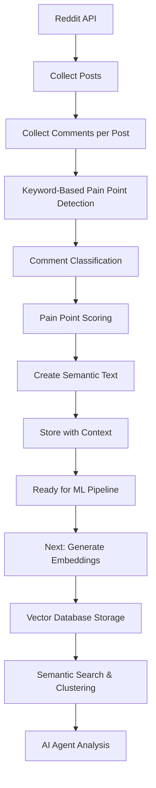

# Reddit Comment Analysis Flow for Semantic Search Agent

## 🔄 **Current Data Collection & Analysis Flow**



## 📊 **Current Keyword-Based Approach**

### What We're Doing Now:
```python
# Keyword-based pain point detection
pain_indicators = [
    'pain', 'hurt', 'ache', 'injury', 'problem', 'issue', 'struggle',
    'difficult', 'can\'t', 'unable', 'fail', 'wrong', 'mistake'
]

# Simple scoring
for keyword in pain_indicators:
    if keyword in comment.lower():
        score += keyword_weight
```

### Example Results:
```
Comment: "I have knee pain during squats"
→ Keywords found: ["pain"]
→ Pain Score: 0.3
→ Classification: pain_point
```

## 🤔 **Why Keyword-Based Detection? (Bootstrap Phase)**

### 1. **Cold Start Problem**
- We need labeled data to train ML models
- Keyword detection creates initial training labels
- Helps identify what IS and ISN'T a pain point

### 2. **Data Quality Control**
- Filters obviously irrelevant comments early
- Reduces noise in the dataset
- Creates clean training data for ML models

### 3. **Computational Efficiency**
- Fast processing during data collection
- No model inference needed at collection time
- Can process thousands of comments quickly

### 4. **Explainable Results**
- Easy to debug and understand
- Clear why a comment was flagged
- Helps validate our assumptions

## 🧠 **The Semantic Search ML Pipeline (What's Coming Next)**


## 🔍 **Why Semantic Search is Superior to Keywords**

### Keyword Limitations:
```
❌ "My knee feels great after squats" 
   → Contains "knee" but NOT a pain point

❌ "I struggle with motivation to workout"
   → Contains "struggle" but different type of problem

❌ "The exercise was challenging but rewarding"
   → Contains "difficult" but positive context
```

### Semantic Understanding:
```
✅ "Every time I squat, my knees feel uncomfortable"
   → No direct "pain" keyword, but clearly a pain point

✅ "I can't seem to progress past this plateau"
   → Different type of struggle (performance vs physical)

✅ "Form breakdown leads to discomfort in lower back"
   → Technical description of pain point
```

## 🎯 **Two-Phase Approach: Why It Makes Sense**

### Phase 1: Data Collection (Current - Keywords)
```python
# Goal: Efficiently collect and initially filter data
def collect_comments():
    comments = get_reddit_comments()
    filtered = keyword_filter(comments)  # Remove obvious noise
    labeled = initial_classification(filtered)  # Bootstrap labels
    return clean_dataset
```

### Phase 2: Semantic Analysis (Next - ML/NLP)
```python
# Goal: Deep understanding and accurate classification
def semantic_analysis():
    embeddings = generate_embeddings(comments)  # sentence-transformers
    clusters = semantic_clustering(embeddings)  # Group similar issues
    classifications = ml_classify(embeddings)   # Trained model
    pain_points = extract_pain_insights(clusters)
    return semantic_understanding
```

## 🔬 **The Complete Semantic Search Strategy**

### 1. **Embedding Generation** (Chunk 3)
```python
# Transform text to vectors that capture semantic meaning
"I have knee pain during squats" → [0.1, -0.3, 0.8, ..., 0.2]
"My knees hurt when I squat"     → [0.1, -0.2, 0.9, ..., 0.3]
# These vectors are similar despite different words!
```

### 2. **Semantic Similarity**
```python
# Find similar pain points regardless of exact words
query = "knee discomfort"
similar_comments = [
    "My knees ache after leg day",      # Similar: 0.89
    "Knee joint feels stiff",           # Similar: 0.85
    "I love leg workouts"               # Different: 0.12
]
```

### 3. **Context Understanding**
```python
# The ML model understands context:
"My back pain is gone"        → NOT a current pain point
"My back pain is getting worse" → IS a current pain point
"Back pain prevention tips"     → Advice/solution content
```

## 📈 **Evolution from Keywords → Semantic Understanding**

### Stage 1: Keyword Bootstrap (✅ Complete)
```
Input: Raw Reddit comments
Filter: Keyword-based detection
Output: Initially labeled dataset
Purpose: Create training data
```

### Stage 2: Embedding Generation (🔄 Next)
```
Input: Labeled comments + context
Process: sentence-transformers embedding
Output: Vector representations
Purpose: Capture semantic meaning
```

### Stage 3: ML Classification (🔄 Future)
```
Input: Embeddings + manual labels
Train: Classification model
Output: Accurate pain point detection
Purpose: Understand context and nuance
```

### Stage 4: Agent Reasoning (🔄 Future)
```
Input: Semantic clusters
Process: LLM analysis of patterns
Output: Actionable insights
Purpose: Generate solutions
```

## 🎯 **Why This Progression Makes Sense**

### 1. **Learning Pipeline**
- Start simple to understand the domain
- Build complexity gradually
- Each stage informs the next

### 2. **Data Quality**
- Keywords filter obvious noise
- Manual validation improves labels
- Clean data trains better models

### 3. **Practical Development**
- Working system at each stage
- Can validate assumptions early
- Incrementally improve accuracy

## 🔮 **The Semantic Search Advantage**

Once we implement the full semantic pipeline:

### Context Understanding:
```python
# Keyword approach:
"I can't lift heavy anymore" → missed (no "pain" keyword)

# Semantic approach:
"I can't lift heavy anymore" → high similarity to:
- "My strength has decreased"
- "I'm getting weaker"
- "My performance is declining"
→ Classified as: performance_pain_point
```

### Implicit Pain Points:
```python
# Keyword approach:
"My form breaks down on rep 8" → missed

# Semantic approach:
"My form breaks down on rep 8" → similar to:
- "I lose technique when tired"
- "I can't maintain proper form"
- "My movement pattern deteriorates"
→ Classified as: technical_limitation_pain_point
```

### Solution Matching:
```python
# Pain point cluster: "Lower back discomfort during deadlifts"
# Semantic search finds solutions:
- "Hip flexor stretches helped my deadlift back pain"
- "Core strengthening eliminated my lower back issues"
- "Form cues that fixed my deadlift back problems"
```

## 🚀 **Next Steps: Implementing Semantic Understanding**

1. **Generate Embeddings** using sentence-transformers
2. **Cluster Similar Comments** to find pain point patterns
3. **Train Classification Model** on keyword-bootstrapped data
4. **Validate with Human Labels** to improve accuracy
5. **Build Agent Reasoning** to generate insights

The keyword approach was our bootstrap - now we're ready for true semantic understanding! 🧠✨
